## **Tugas Akhir UAS** 

**Perancangan Sistem Prediksi Penjualan Barang Menggunakan Decision Tree dan Rekomendasi Produk Berdasarkan Algoritma Apriori untuk Membantu Manajemen Stok Warung** 

**Mata Kuliah Rekayasa Perangkat Lunak dan Manajemen Proyek Muhammad Rizkiana Pratama** 

**2404421** 

**C1** 

## **DAFTAR ISI** 

|**DAFTAR ISI**||
|---|---|
|**DAFTAR ISI**|**2**|
|**1. Pendahuluan**|**4**|
|1.1. Latar Belakang|4|
|1.2. Rumusan Masalah|4|
|1.3. Tujuan|4|
|1.4. Manfaat|5|
|1.5. Ruang Lingkup|5|
|1.6. Metodologi Pengembangan Agile|5|
|**2. Requirement Engineering**|**5**|
|2.1. Deskripsi Sistem|5|
|2.2. Analisis Permasalahan|6|
|2.3. Analisis Stakeholder|6|
|2.4. Kebutuhan Fungsional|6|
|2.5. Kebutuhan Non Fungsional|7|
|2.6. Proses Bisnis|7|
|2.7. Use Case Diagram|8|
|2.8. Use Case Description|8|
|2.9. Activity Diagram|11|
|**3. Analisis Kelayakan**|**13**|
|3.1. Work Breakdown Structure (WBS)|13|
|3.2. Estimasi Waktu|14|
|3.3. Estimasi SDM|15|
|3.4. Estimasi Biaya|15|
|3.5. Analisis ROI|15|
|3.6. Analisis Payback Period|16|
|3.7. Analisis Risiko|17|
|**4. Perancangan Perangkat Lunak**|**18**|
|4.1. Arsitektur Sistem|18|
|4.1.1. Spesifikasi Teknologi dan Lingkungan Pengembangan|18|
|4.2. Perancangan Proses|19|
|4.2.1. Sequence Diagram Transaksi Penjualan|19|
|4.2.2. Sequence Diagram Prediksi Penjualan|20|
|4.3. Perancangan Data|20|
|4.3.1. Class Diagram|20|
|4.3.2. ERD|21|
|4.3.3. Struktur Database|22|
|4.4. Perancangan Machine Learning (Decision Tree & Apriori)|25|
|4.4.1. Deskripsi Model Prediksi (Decision Tree) & Asosiasi (Apriori)|25|
|4.4.2. Struktur Variabel Input (Features) dan Output (Target)|25|
|4.4.3. Aturan Rekomendasi Angka Pembelian Stok (Restock Rule)|26|
|4.4.4. Alur Proses ML dan Market Basket Analysis|26|
|4.4.5. Integrasi ML & Apriori ke Sistem|27|
|4.5. Perancangan Antarmuka|28|
|4.5.1. Rancangan Antarmuka Halaman Login|29|
|4.5.2. Rancangan Antarmuka Dashboard Utama|29|
|4.5.3. Rancangan Antarmuka Halaman Analisis Prediksi dan Rekomendasi Asosiasi|30|
|**5. Kesimpulan dan Saran**|**31**|
|5.1. Kesimpulan|31|
|5.2. Saran|32|
|**Daftar Referensi**|**33**|

## **1. Pendahuluan** 

## **1.1. Latar Belakang** 

Perkembangan teknologi informasi telah mendorong berbagai sektor usaha untuk memanfaatkan sistem digital dalam mendukung kegiatan operasional. Salah satu sektor yang dapat memperoleh manfaat dari penerapan teknologi informasi adalah usaha warung. Sebagian besar warung masih melakukan pencatatan penjualan dan pengelolaan stok barang secara manual sehingga proses pengawasan persediaan barang menjadi kurang efektif. 

Pengelolaan stok yang tidak tepat dapat menyebabkan dua permasalahan utama, yaitu kekurangan stok saat permintaan meningkat dan penumpukan stok saat permintaan menurun. Kondisi tersebut dapat berdampak pada menurunnya kualitas pelayanan kepada pelanggan serta meningkatnya biaya penyimpanan barang. Selain itu, pemilik warung sering mengalami kesulitan dalam memperkirakan jumlah barang yang harus disediakan untuk periode berikutnya karena keputusan pembelian masih didasarkan pada perkiraan pribadi. 

Machine Learning dapat digunakan untuk membantu memprediksi jumlah penjualan barang berdasarkan data transaksi yang telah terjadi sebelumnya. Hasil prediksi tersebut dapat dimanfaatkan sebagai dasar pengambilan keputusan dalam pengelolaan persediaan barang sehingga proses restock dapat dilakukan secara lebih terencana. 

Berdasarkan permasalahan tersebut, dirancang sebuah Sistem Prediksi Penjualan Barang untuk Mendukung Pengelolaan Stok Warung Menggunakan Algoritma Decision Tree dan Rekomendasi Produk Berdasarkan Algoritma Apriori. Sistem ini diharapkan mampu membantu pemilik warung dalam melakukan pencatatan transaksi, pengelolaan stok, prediksi penjualan, serta mendapatkan rekomendasi item pendamping untuk mendukung pengambilan keputusan yang lebih tepat. 

## **1.2. Rumusan Masalah** 

Berdasarkan latar belakang yang telah diuraikan, rumusan masalah dalam pengembangan sistem ini adalah sebagai berikut: 

1. Bagaimana merancang sistem informasi yang dapat membantu pengelolaan data penjualan dan stok barang pada warung? 

2. Bagaimana menerapkan algoritma Machine Learning untuk memprediksi jumlah penjualan barang berdasarkan data historis transaksi? 

3. Bagaimana menyediakan informasi prediksi yang dapat digunakan sebagai dasar pengambilan keputusan dalam pengelolaan stok barang? 

## **1.3. Tujuan** 

Tujuan yang ingin dicapai dalam pengembangan sistem ini adalah sebagai berikut: 

1. Merancang dan membangun sistem informasi penjualan dan pengelolaan stok barang pada warung. 

2. Menerapkan algoritma Decision Tree & Apriori untuk melakukan prediksi jumlah penjualan barang dan menghasilkan rekomendasi produk pendamping (cross-selling). 

3. Membantu pemilik warung dalam menentukan kebutuhan stok barang berdasarkan hasil prediksi penjualan. 

4. Meningkatkan efektivitas pengelolaan persediaan barang melalui pemanfaatan teknologi informasi dan Machine Learning. 

## **1.4. Manfaat** 

Manfaat yang diharapkan dari pengembangan sistem ini adalah sebagai berikut: 

1. Membantu pencatatan transaksi secara terstruktur. 

2. Membantu memantau stok barang secara lebih mudah. 

3. Membantu menentukan jumlah pembelian barang untuk periode berikutnya. 

## **1.5.** 

## **Ruang Lingkup** 

Ruang lingkup pengembangan sistem dibatasi pada beberapa hal berikut: 

1. Sistem berbasis web. 

2. Pengguna sistem terdiri dari pemilik warung. 

3. Sistem menyediakan fitur pengelolaan data barang, transaksi penjualan, laporan penjualan, prediksi penjualan, dan rekomendasi produk pendamping.

4. Data yang digunakan untuk proses prediksi berasal dari data historis transaksi penjualan. 

5. Algoritma Machine Learning yang digunakan adalah Decision Tree untuk prediksi kuantitas penjualan dan Apriori untuk analisis asosiasi (Market Basket Analysis). 

6. Sistem tidak mencakup pengelolaan keuangan, akuntansi, maupun transaksi pembelian dari supplier. 

## **1.6. Metodologi Pengembangan Agile** 

Metodologi pengembangan perangkat lunak yang digunakan dalam proyek ini adalah Agile Development dengan menggunakan kerangka kerja (framework) Scrum. Metode ini dipilih karena sifat pengembangannya yang adaptif, kolaboratif, dan berbasis iterasi pendek (Sprint). Hal ini sangat krusial dalam memfasilitasi proses eksperimen akurasi modul Machine Learning tanpa mengganggu jalannya pengembangan fitur web utama. 

Proses pengembangan dengan metode Scrum ini dibagi ke dalam empat tahapan utama, yaitu: 

1. Product Backlog Creation: Mengidentifikasi dan menyusun seluruh daftar kebutuhan fitur sistem (seperti manajemen barang, transaksi, dan prediksi penjualan) berdasarkan skala prioritas pengguna. 

2. Sprint Planning: Pertemuan awal sebelum memulai setiap iterasi untuk menentukan daftar fitur (Backlog) yang akan diselesaikan dalam kurun waktu Sprint berjalan. 

3. Sprint Execution: Fase pengerjaan fitur yang meliputi aktivitas desain, koding (backend dan frontend), serta pengujian unit secara simultan. Proyek ini membagi lini pengerjaan ke dalam 3 Sprint utama dengan durasi masing-masing 2 hingga 3 minggu. 

4. Sprint Review & Retrospective: Tahap evaluasi di akhir setiap Sprint bersama Pemilik Warung untuk mendemonstrasikan fitur yang sudah selesai, mendapatkan umpan balik langsung, serta mengevaluasi efisiensi kerja tim untuk iterasi berikutnya. 

## **2. Requirement Engineering** 

## **2.1. Deskripsi Sistem** 

Sistem Prediksi Penjualan Barang untuk Mendukung Pengelolaan Stok Warung Menggunakan Algoritma Decision Tree dan Rekomendasi Produk Berdasarkan Algoritma Apriori merupakan aplikasi berbasis web yang dirancang untuk membantu pemilik warung dalam mengelola data barang, transaksi penjualan, serta melakukan prediksi penjualan dan rekomendasi produk pendamping berdasarkan data historis yang tersedia. 

Sistem menyediakan fitur pencatatan data barang, pengelolaan stok, pencatatan transaksi penjualan, pembuatan laporan penjualan, prediksi jumlah penjualan pada periode berikutnya, serta analisis asosiasi produk. Hasil prediksi digunakan sebagai dasar dalam menentukan jumlah stok yang perlu disediakan sehingga risiko kehabisan atau penumpukan barang dapat dikurangi, sementara hasil analisis asosiasi digunakan untuk strategi bundling dan penawaran barang pendamping. 

Sistem menggunakan algoritma Decision Tree Regression untuk menghasilkan prediksi jumlah penjualan berdasarkan pola data transaksi sebelumnya, serta algoritma Apriori untuk mengidentifikasi produk yang paling sering dibeli secara bersamaan. Dengan adanya sistem ini, proses pengambilan keputusan terkait pengelolaan persediaan barang dan pemasaran produk dapat dilakukan secara lebih teratur dan terukur. 

## **2.2. Analisis Permasalahan** 

Pengelolaan warung masih banyak dilakukan secara manual, baik dalam pencatatan transaksi maupun pengelolaan stok barang. Kondisi tersebut menimbulkan beberapa permasalahan sebagai berikut: 

1. Pemilik warung mengalami kesulitan dalam mengetahui jumlah stok barang secara akurat. 

2. Tidak tersedia informasi mengenai pola penjualan barang yang dapat digunakan sebagai dasar pengambilan keputusan. 

3. Proses restock barang masih dilakukan berdasarkan perkiraan sehingga sering terjadi kekurangan atau kelebihan stok. 

4. Pembuatan laporan penjualan membutuhkan waktu karena data harus direkap secara manual. 

5. Tidak terdapat sistem yang dapat membantu memprediksi kebutuhan stok barang pada periode berikutnya. 

Berdasarkan permasalahan tersebut, diperlukan sebuah sistem yang mampu mengelola data penjualan sekaligus melakukan prediksi penjualan untuk mendukung proses pengelolaan stok barang. 

## **2.3.** 

## **Analisis Stakeholder** 

Stakeholder yang terlibat dalam sistem ini adalah pemilik warung yang berperan sebagai pemilik warung sekaligus sebagai admin. Peran: 

- a. Mengelola data barang. 

- b. Mengelola stok barang. 

- c. Mencatat transaksi penjualan. 

- d. Melihat laporan penjualan. 

- e. Melihat hasil prediksi penjualan. 

- f. Mengambil keputusan restock. 

Kebutuhan: 

- a. Informasi stok barang. 

- b. Informasi penjualan. 

- c. Hasil prediksi penjualan. 

- d. Rekomendasi restock barang. 

## **2.4.** 

## **Kebutuhan Fungsional** 

Sistem harus mampu menyediakan fungsi-fungsi berikut: 

- a. Sistem dapat melakukan autentikasi pengguna. 

- b. Sistem dapat menambah, mengubah, menghapus, dan menampilkan data barang. 

- c. Sistem dapat mencatat transaksi penjualan. 

- d. Sistem dapat memperbarui jumlah stok barang secara otomatis setelah transaksi dilakukan. 

- e. Sistem dapat menampilkan data stok barang. 

- f. Sistem dapat menghasilkan laporan penjualan. 

- g. Sistem dapat mengolah data historis penjualan sebagai dataset prediksi. 

- h. Sistem dapat melakukan prediksi jumlah penjualan menggunakan algoritma Decision Tree. 

- i. Sistem dapat menampilkan hasil prediksi penjualan. 

- j. Sistem dapat memberikan rekomendasi jumlah stok yang perlu disediakan berdasarkan hasil prediksi. 

- k. Sistem dapat melakukan analisis asosiasi penjualan produk menggunakan algoritma Apriori.

- l. Sistem dapat menampilkan rekomendasi produk pendamping (frequently bought together) berdasarkan aturan asosiasi yang terbentuk. 

## **2.5. Kebutuhan Non Fungsional** 

1. Usability 

Sistem harus memiliki antarmuka yang mudah dipahami oleh pengguna. 

2. Performance 

   - Sistem harus mampu menampilkan halaman dalam waktu yang cepat 

3. Reliability 

   - Data transaksi dan stok harus tersimpan dengan baik tanpa kehilangan data. 

4. Security 

   - Sistem harus menyediakan mekanisme login dan pengelolaan hak akses pengguna. 

5. Availability 

Sistem dapat diakses selama terdapat koneksi internet dan server aktif. 

6. Maintainability 

   - Sistem harus mudah dikembangkan dan dipelihara pada masa mendatang. 

## **2.6. Proses Bisnis** 

Proses bisnis pada Sistem Prediksi Penjualan Barang untuk Mendukung Pengelolaan Stok Warung dimulai dari pengelolaan data barang hingga proses prediksi penjualan. Sistem dirancang untuk membantu pemilik warung dalam mengelola transaksi serta menentukan kebutuhan stok berdasarkan data historis penjualan. 

Alur proses bisnis sistem adalah sebagai berikut: 

1. Pemilik warung melakukan login ke dalam sistem menggunakan akun yang telah terdaftar. 

2. Pemilik warung mengelola data barang yang meliputi penambahan, perubahan, dan penghapusan data barang. 

3. Pemilik warung mencatat transaksi penjualan yang terjadi melalui sistem. 

4. Sistem menyimpan data transaksi penjualan ke dalam database. 

5. Sistem memperbarui jumlah stok barang secara otomatis berdasarkan jumlah barang yang terjual. 

6. Sistem mengumpulkan data historis penjualan yang tersimpan dalam database. 

7. Data historis digunakan oleh modul Machine Learning untuk melakukan proses prediksi penjualan menggunakan algoritma Decision Tree Regression. 

8. Sistem menghasilkan prediksi jumlah penjualan untuk periode berikutnya. 

9. Sistem menampilkan hasil prediksi penjualan kepada pemilik warung. 

10. Pemilik warung menggunakan hasil prediksi sebagai dasar dalam menentukan kebutuhan restock barang. 

11. Sistem menghasilkan laporan penjualan dan laporan stok yang dapat digunakan untuk keperluan monitoring dan evaluasi. 

12. Sistem menganalisis pola transaksi menggunakan algoritma Apriori untuk menghasilkan aturan asosiasi produk.

13. Sistem menyajikan rekomendasi produk pendamping ketika pemilik warung mencatat transaksi penjualan. 

Proses bisnis yang diusulkan diharapkan dapat membantu pemilik warung dalam melakukan pengelolaan stok secara lebih terencana melalui pemanfaatan data historis penjualan dan hasil prediksi yang dihasilkan oleh sistem. 

## **2.7.** 

## **Use Case Diagram** 

Use Case Diagram digunakan untuk menggambarkan interaksi antara aktor dengan sistem yang dibangun. Pada sistem prediksi penjualan barang untuk mendukung pengelolaan stok warung, terdapat satu aktor yaitu Pemilik Warung yang berinteraksi dengan berbagai fungsi yang disediakan oleh sistem. 

**Gambar 1.** Use Case Diagram Sistem Prediksi Penjualan Barang untuk Mendukung Pengelolaan Stok Warung 

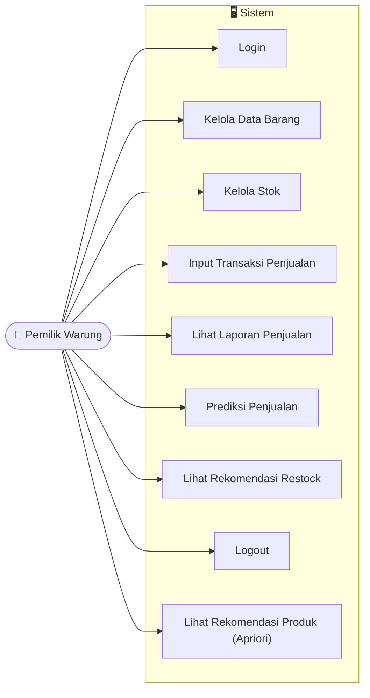

Berdasarkan Gambar 1, aktor Pemilik Warung dapat melakukan login, mengelola data barang, mengelola stok, mencatat transaksi penjualan, melihat laporan penjualan, melakukan prediksi penjualan, melihat rekomendasi restock, dan logout dari sistem. 

## **2.8. Use Case Description** 

Use Case Description digunakan untuk menjelaskan rincian setiap use case yang terdapat pada sistem. 

## 1. Login 

|**Elemen**|**Deskripsi**|
|---|---|
|Nama Use Case|Login|

|Aktor|Pemilik Warung|
|---|---|
|Tujuan|Masuk ke sistem|
|Pre-condition|Pengguna memiliki akun|
|Post-condition|Sistem menampilkan dashboard|

**Tabel 1.** Use Case Description Login 

## 2. Kelola Barang 

|**Elemen**|**Deskripsi**|
|---|---|
|Nama Use Case|Kelola Barang|
|Aktor|Pemilik Warung|
|Tujuan|Mengelola data barang|
|Pre-condition|Sudah login|
|Post-condition|Data barang tersimpan|

**Tabel 2.** Use Case Description Kelola Barang 

## 3. Kelola Stok 

|**Elemen**|**Deskripsi**|
|---|---|
|Nama Use Case|Kelola Stok|
|Aktor|Pemilik Warung|
|Tujuan|Mengelola jumlah stok|
|Pre-condition|Sudah login|
|Post-condition|Data barang tersimpan|

**Tabel 3.** Use Case Description Kelola Stok 

## 4. Input Transaksi Penjualan 

|**Elemen**|**Deskripsi**|
|---|---|
|Nama Use Case|Input Transaksi Penjualan|
|Aktor|Pemilik Warung|
|Tujuan|Mencatat transaksi penjualan|
|Pre-condition|Sudah login|
|Post-condition|Data transaksi tersimpan dan stok diperbarui|

**Tabel 4.** Use Case Description Input Transaksi Penjualan 

5. Lihat Laporan Penjualan 

|**Elemen**|**Deskripsi**|
|---|---|
|Nama Use Case|Lihat Laporan Penjualan|
|Aktor|Pemilik Warung|
|Tujuan|Memantau rekapitulasi data transaksi penjualan dan omzet secara terstruktur|
|Pre-condition|Sudah Login|
|Post-condition|Laporan Penjualan ditampilkan|

**Tabel 5.** Use Case Description Lihat Laporan Penjualan 

6. Prediksi Penjualan 

|**Elemen**|**Deskripsi**|
|---|---|
|Nama Use Case|Prediksi Penjualan.|
|Aktor|Pemilik Warung|
|Tujuan|Memperkirakan penjualan periode berikutnya|
|Pre-condition|Data historis tersedia|
|Post-condition|Hasil prediksi ditampilkan|

**Tabel 6.** Use Case Description Prediksi Penjualan 

7. Lihat Rekomendasi Restock 

|**Elemen**|**Deskripsi**|
|---|---|
|Nama Use Case|Lihat Rekomendasi Restock|
|Aktor|Pemilik Warung|
|Tujuan|Mengetahui kebutuhan stok|
|Pre-condition|Prediksi telah dilakukan|
|Post-condition|Rekomendasi restock ditampilkan|

**Tabel 7.** Use Case Description Lihat Rekomendasi Restock 

## 8. Logout 

|**Elemen**|**Deskripsi**|
|---|---|
|Nama Use Case|Logout|
|Aktor|Pemilik Warung|

|Tujuan|Keluar dari sistem|
|---|---|
|Pre-condition|Sudah login|
|Post-condition|Sesi pengguna berakhir|

**Tabel 8.** Use Case Description Logout 

## **2.9. Activity Diagram** 

Activity diagram digunakan untuk menjelaskan rincian setiap use case yang terdapat pada sistem 

1. Activity Diagram: Autentikasi (Login) 

Alur standar pintu masuk sistem untuk memastikan keamanan data. 

**Gambar 2.** Activity Diagram Autentikasi 

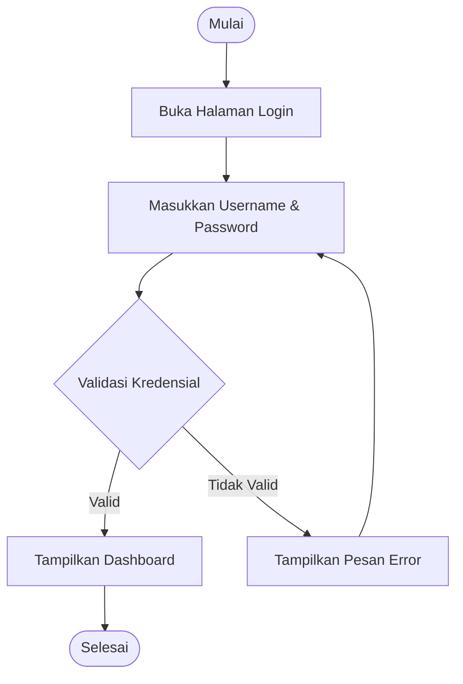

2. Activity Diagram: Kelola Transaksi Penjualan 

Alur pencatatan transaksi yang secara otomatis memperbarui stok barang di warung dan menampilkan rekomendasi silang. 

**Gambar 3.** Activity Diagram Transaksi Penjualan 

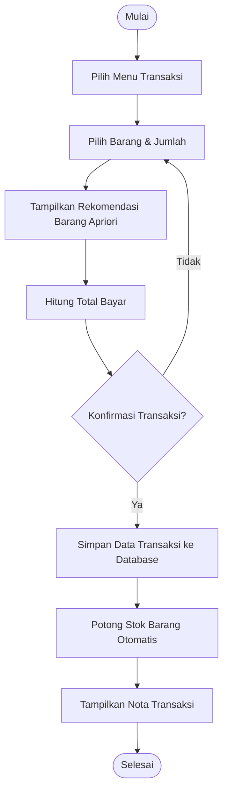

3. Activity Diagram: Proses Prediksi Penjualan & Rekomendasi Restock Alur ini menggambarkan bagaimana Pemilik Warung meminta prediksi hingga sistem mengolahnya menggunakan algoritma Decision Tree. 

**Gambar 4.** Activity Diagram Prediksi Penjualan & Rekomendasi Restock 

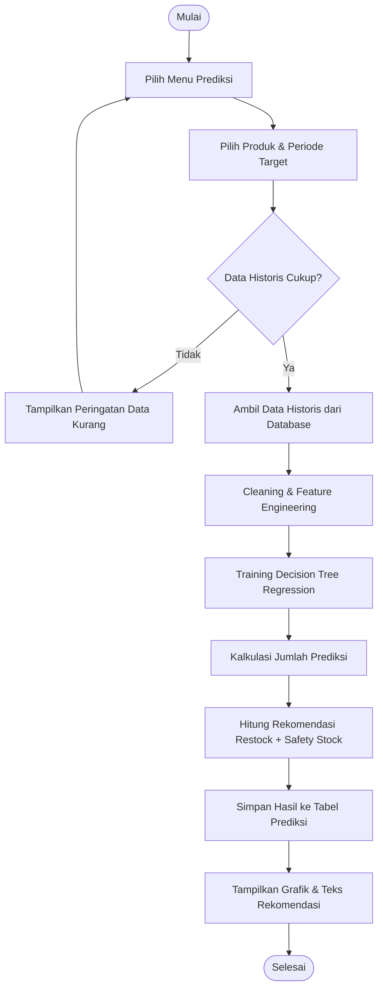

4. Activity Diagram: Analisis Asosiasi Produk (Apriori)
Alur ini menggambarkan bagaimana sistem mengolah seluruh transaksi penjualan menggunakan algoritma Apriori untuk melahirkan daftar barang yang sering dibeli bersamaan.

**Gambar 4b.** Activity Diagram Analisis Asosiasi Produk (Apriori)

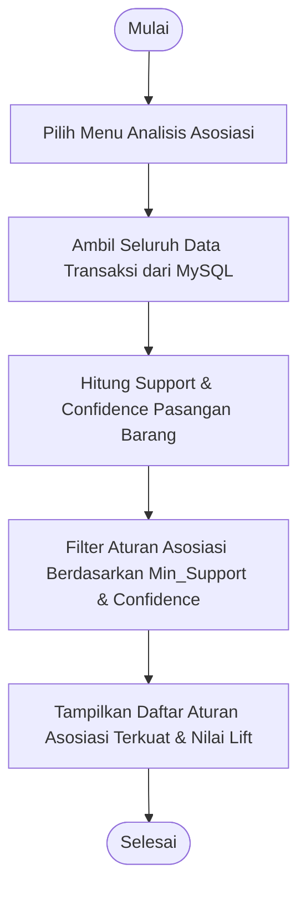

## **3. Analisis Kelayakan** 

## **3.1. Work Breakdown Structure (WBS)** 

Work Breakdown Structure (WBS) pada proyek ini didekomposisikan secara hierarkis berdasarkan siklus iterasi Sprint pada kerangka kerja Scrum, bukan berdasarkan fase linier tradisional. Struktur ini memecah pekerjaan menjadi paket kerja (work packages) yang adaptif untuk memastikan setiap iterasi menghasilkan produk yang dapat berfungsi (shippable product) 

**Gambar 5.** Work Breakdown Structure (WBS) 

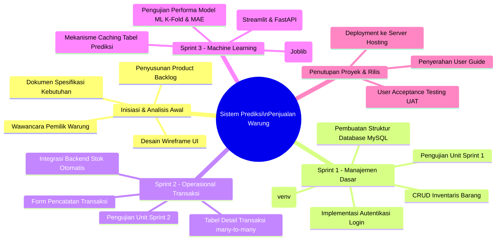

Berdasarkan rancangan hierarki WBS pada Gambar 5, dekomposisi pekerjaan tidak lagi didasarkan pada fase linier tradisional, melainkan diatur secara adaptif mengikuti siklus hidup kerangka kerja Scrum. Pembagian kerja ini disusun untuk memastikan bahwa setiap iterasi (Sprint) mampu menghasilkan fungsionalitas sistem yang berjalan dengan baik dan dapat langsung dievaluasi oleh pengguna akhir. Penjelasan detail mengenai pembagian paket kerja (work packages) pada setiap tingkatan komponen dijabarkan sebagai berikut: 

Fase Inisiasi dan Analisis Awal ditempatkan sebagai fondasi utama sebelum siklus iterasi dimulai. Pada tahapan ini, tim fokus melakukan penggalian data kebutuhan melalui aktivitas wawancara langsung dengan Pemilik Warung guna memetakan kendala nyata di lapangan. Hasil analisis tersebut kemudian ditransformasikan menjadi dokumen spesifikasi kebutuhan, perancangan cetak biru (wireframe) antarmuka aplikasi, serta penyusunan daftar Product Backlog yang berisi prioritas fitur yang akan dikembangkan pada fase-fase berikutnya. 

Memasuki Sprint 1 yang berfokus pada Manajemen Dasar, paket kerja diarahkan untuk membangun fondasi arsitektur perangkat lunak dan data. Aktivitas dimulai dengan melakukan konfigurasi lingkungan pengembangan virtual environment (venv), server backend berbasis FastAPI, serta pembuatan struktur basis data relasional menggunakan MySQL. Setelah infrastruktur siap, pengerjaan dilanjutkan dengan mengimplementasikan kode program untuk fitur autentikasi keamanan (Halaman Login) serta modul pengelolaan master data barang (CRUD inventaris). Iterasi ini ditutup dengan melakukan pengujian unit fungsionalitas dasar sebelum didemonstrasikan kepada pengguna. 

Paket kerja pada Sprint 2 diarahkan sepenuhnya untuk menangani Operasional Transaksi penjualan harian yang menjadi inti aktivitas bisnis warung. Tim berfokus mengembankan komponen formulir pencatatan transaksi penjualan pada sisi frontend (Streamlit) dan menyambungkannya dengan logic server di sisi backend (FastAPI). Alur kerja penting pada iterasi ini adalah implementasi fungsi otomatisasi pemotongan jumlah stok fisik barang yang tersimpan di dalam database MySQL setiap kali nota transaksi berhasil diterbitkan. Selain itu, dilakukan integrasi tabel detail transaksi untuk memfasilitasi relasi data komoditas yang bersifat many-to-many. 

Sprint 3 merupakan fase krusial yang mengintegrasikan kecerdasan buatan dan visualisasi akhir pada sistem. Pada tahapan ini, tim melakukan implementasi dan pelatihan algoritma Decision Tree Regression memanfaatkan pustaka Scikit-Learn serta penyimpanan model terlatih menggunakan Joblib untuk menghasilkan nilai proyeksi penjualan yang akurat. Guna menjaga performa server agar tetap ringan, dirancang pula mekanisme penyimpanan berbasis caching data pada tabel prediksi. Seluruh hasil komputasi model kemudian diintegrasikan ke dalam halaman dasbor prediksi Streamlit melalui teks instruksi penyediaan stok ulang (restock) yang ramah pengguna lanjut usia. Iterasi ketiga ini diakhiri dengan pengujian performa model ML menggunakan metrik statistik K-Fold Cross Validation dan Mean Absolute Error (MAE). 

Fase terakhir dalam struktur WBS ini adalah Penutupan Proyek dan Rilis yang menandai akhir dari siklus pengembangan. Paket kerja pada komponen ini berfokus pada pelaksanaan User Acceptance Testing (UAT) untuk memvalidasi tingkat penerimaan pengguna, terutama terkait aspek kemudahan membaca dan operasional sistem oleh pemilik warung. Setelah aplikasi dinyatakan lolos uji dan memenuhi seluruh kriteria kebutuhan, sistem web kemudian diunggah (deployment) secara penuh ke server cloud hosting agar dapat diakses secara publik, diikuti dengan penyerahan buku panduan operasional (user guide) kepada pemilik warung. **3.2. Estimasi Waktu** 

Proyek pembangunan sistem ini direncanakan selesai dalam kurun waktu total 8 minggu (2 bulan) yang diatur menggunakan kerangka kerja Agile Scrum. Manajemen waktu tidak berjalan secara linear sekuensial, melainkan dibagi ke dalam fase persiapan awal dan 3 siklus Sprint fungsional. Berikut adalah tabel matriks jadwal pelaksanaan proyek berbasis Sprint: 

|**Aktivitas**|**Durasi**|**Target Output**|
|---|---|---|
|Inisiasi & Analisis Awal|Minggu 1|Dokumen Spesifikasi Kebutuhan, Desain Wireframe UI, dan Product Backlog.|
|Sprint 1|Minggu 2 – Minggu 3|Struktur database MySQL terbentuk, halaman login, dan fitur kelola data barang selesai.|
|Sprint 2|Minggu 4 – Minggu 5|Modul transaksi penjualan selesai dan stok barang otomatis terpotong saat nota disimpan|
|Sprint 3|Minggu 6 – Minggu 7|Modul Decision Tree (Scikit-Learn & Joblib) terintegrasi, tabel prediksi berfungsi, dan halaman ramalan jualan selesai.|

|Final Review, UAT & Rilis|Minggu 8|Pengujian fungsionalitas menyeluruh, uji coba bersama Pemilik Warung, dan deployment aplikasi ke server hosting.|
|---|---|---|
|Total|8 Minggu|Sistem Siap Digunakan Secara Penuh|

**Tabel 9.** Estimasi Waktu Pelaksanaan Proyek 

## **3.3. Estimasi SDM** 

Proyek ini dikerjakan oleh tim yang terdiri dari 5 orang personel dengan pembagian peran yang spesifik guna memastikan isolasi layanan backend, visualisasi frontend, dan akurasi model Machine Learning berjalan optimal: 

|**Posisi**|**Jumlah**|
|---|---|
|System Analyst|1|
|Backend Developer|1|
|Frontend Developer|1|
|Machine Learning Engineer|1|
|Tester|1|

**Tabel 10.** Estimasi Sumber Daya Manusia 

## **3.4.** 

## **Estimasi Biaya** 

Berikut adalah asumsi rincian anggaran biaya (budgeting) yang diperlukan untuk pengembangan sistem selama 2 bulan serta biaya operasional pasca-rilis: 

|**Komponen**|**Biaya**|
|---|---|
|Domain|Rp150.000|
|Hosting|Rp500.000|
|Internet|Rp200.000|
|Pengembangan Sistem|Rp3.000.000|
|Pengujian|Rp500.000|
|Total|Rp4.350.000|

**Tabel 11.** Estimasi Anggaran Biaya 

## **3.5.** 

## **Analisis ROI** 

Analisis Return of Investment (ROI) digunakan untuk mengukur efisiensi investasi dengan melihat persentase keuntungan bersih yang dihasilkan terhadap total biaya yang telah dikeluarkan selama 3 tahun masa operasional sistem. Untuk mempermudah perhitungan, seluruh komponen biaya pengembangan, biaya operasional, serta proyeksi manfaat finansial warung dirangkum dalam tabel berikut: 

|**Periode**|**Komponen Biaya**|**Nilai Biaya**|**Proyeksi** **Manfaat Bersih**|
|---|---|---|---|
|Tahun 0|Biaya Investasi Awal (Domain, Hosting, Web Dev, dll)|Rp 4.350.000|-|
|Tahun 1|Biaya Operasional & Pemeliharaan|Rp 850.000|Rp 3.000.000|
|Tahun 2|Biaya Operasional & Pemeliharaan|Rp 850.000|Rp 4.500.000|
|Tahun 3|Biaya Operasional & Pemeliharaan|Rp 850.000|Rp 5.500.000|
|Total||Rp 6.900.000|Rp 13.000.000|

**Tabel 12.** Proyeksi Manfaat dan Biaya (ROI) 

Rumus perhitungan nilai ROI pada proyek ini adalah sebagai berikut: 

**==> picture [237 x 105] intentionally omitted <==**

Berdasarkan hasil kalkulasi di atas, proyek pembangunan perangkat lunak ini dinilai sangat layak untuk dijalankan. Investasi yang dikeluarkan mampu menghasilkan tingkat pengembalian keuntungan (ROI) yang tinggi, yaitu sebesar 88,41% dalam jangka waktu 3 tahun masa operasional warung. 

## **3.6. Analisis Payback Period** 

Analisis Payback Period (PBP) bertujuan untuk mengetahui jangka waktu atau kecepatan pengembalian modal investasi awal yang telah dikeluarkan (sebesar Rp 4.350.000) melalui manfaat bersih yang diterima oleh warung setiap tahunnya. Proses pemulihan nilai investasi awal ini dijabarkan secara bertahap pada tabel akumulasi aliran kas di bawah ini: 

|Periode|Nilai Investasi Awal / Sisa|Manfaat Bersih Tahunan|Status Pengembalian Modal|
|---|---|---|---|
|Tahun 0|Rp 4.350.000|-|Modal awal belum kembali|
|Tahun 1|Rp 4.350.000|Rp 3.000.000|Sisa investasi: Rp 1.350.000|
|Tahun 2|Rp 1.350.000|Rp 4.500.000|Modal kembali|

sepenuhnya 

**Tabel 13.** Akumulasi Aliran Kas (PBP) 

Berdasarkan data tabel di atas, akumulasi manfaat pada Tahun 1 belum mampu menutup total investasi awal, sehingga menyisakan beban modal sebesar Rp 1.350.000. Kekurangan tersebut akan ditutupi oleh manfaat bersih pada Tahun 2 dengan perhitungan rumus PBP sebagai berikut: 

𝑆𝑖𝑠𝑎 𝑁𝑖𝑙𝑎𝑖 𝐼𝑛𝑣𝑒𝑠𝑡𝑎𝑠𝑖 𝑇𝑎ℎ𝑢𝑛 1 𝑃𝐵𝑃 = 1 +[ 1 𝑡𝑎ℎ𝑢𝑛] ~~(~~ 𝑀𝑎𝑛𝑓𝑎𝑎𝑡 𝐵𝑒𝑟𝑠𝑖ℎ 𝑇𝑎ℎ𝑢𝑛2 )[ ×] 

**==> picture [224 x 24] intentionally omitted <==**

**==> picture [187 x 12] intentionally omitted <==**

Melalui konversi perhitungan tersebut, dapat disimpulkan bahwa titik balik modal (break-even point) dari sistem prediksi penjualan warung ini akan tercapai dalam waktu 1,3 tahun atau setara dengan 1 tahun 4 bulan. Periode pengembalian yang berada di bawah estimasi umur ekonomis proyek (3 tahun) ini menegaskan bahwa tingkat risiko finansial proyek tergolong rendah. 

## **3.7. Analisis Risiko** 

Untuk menjamin keberhasilan proyek sesuai dengan prinsip Agile Development, diperlukan manajemen risiko yang adaptif terhadap perubahan di setiap iterasi Sprint. Berikut adalah identifikasi risiko teknis dan operasional beserta strategi mitigasinya: 

1. Risiko Kualitas Data Historis (Data Sparsity) 

   - Deskripsi: Data transaksi awal pada warung berantakan atau dicatat tidak lengkap secara manual, sehingga memengaruhi akurasi prediksi Decision Tree. 

   - Mitigasi: Sistem akan menerapkan validasi input yang ketat pada form transaksi pemilik warung dan tahap pra-pemrosesan data (handling missing values) sebelum dataset dilempar ke modul Machine Learning. 

2. Risiko Overfitting pada Model Prediksi 

   - Deskripsi: Model Decision Tree Regression terlalu menghafal data masa lalu yang sedikit, sehingga meleset saat memprediksi jumlah stok periode baru. 

   - Mitigasi: Melakukan eksperimen tuning hiperparameter (seperti membatasi max_depth pohon keputusan dan min_samples_leaf) serta menggunakan teknik K-Fold Cross Validation saat pelatihan model untuk memastikan generalisasi yang baik. 

3. Risiko Resistensi Pengguna (User Acceptance) 

   - Deskripsi: Pemilik warung kesulitan beradaptasi dengan sistem web baru dan memilih kembali ke pencatatan buku manual. 

   - Mitigasi: Merancang antarmuka seminimalis mungkin (sesuai kebutuhan Usability), serta mengadakan sesi pelatihan (coaching) langsung didampingi penyerahan buku panduan (user guide). 

## **4. Perancangan Perangkat Lunak 4.1. Arsitektur Sistem** 

Sistem ini dirancang menggunakan arsitektur monolitik modular terintegrasi yang memisahkan tanggung jawab antarmuka pengguna, pemrosesan logika bisnis, manajemen data, dan komputasi cerdas, namun tetap berkomunikasi secara mulus dalam satu alur kerja. 

**Gambar 6.** Arsitektur Sistem 

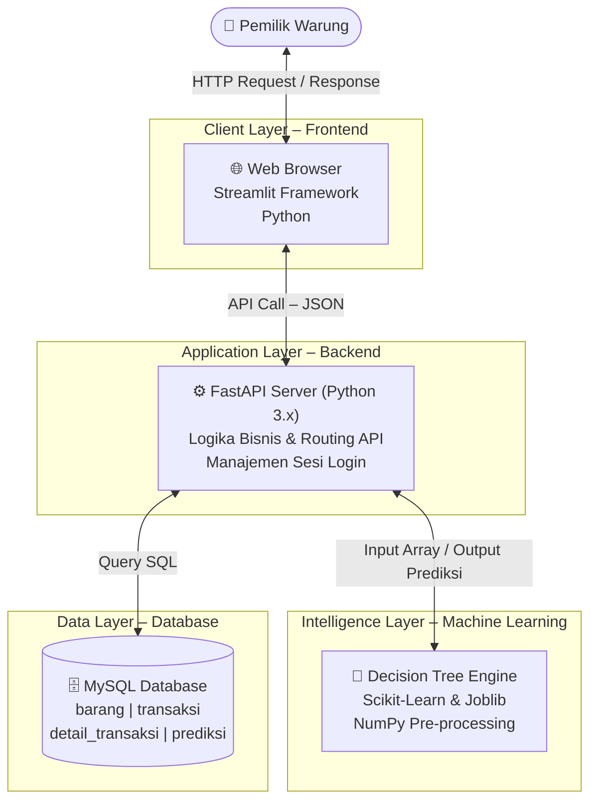

Penjelasan Alur Arsitektur: 

1. Frontend (Client Layer): Berbasis Streamlit web framework tempat Pemilik Warung berinteraksi. Mengirimkan request operasional ke API backend FastAPI (seperti input transaksi atau klik tombol prediksi) dan merender UI. 

2. Backend (Application Layer): Menjadi otak operasional berbasis FastAPI yang menerima request dari frontend Streamlit, memproses logika bisnis, mengelola autentikasi, dan menjembatani data ke layer lain. 

3. Database (Data Layer): Menyimpan seluruh data master barang, stok, dan histori transaksi penjualan secara aman menggunakan MySQL. 

4. Machine Learning (Intelligence Layer): Bertugas melakukan kalkulasi matematika regresi pohon keputusan (Decision Tree) menggunakan Scikit-Learn, menyimpan/memuat model terlatih menggunakan Joblib, dan mengembalikan hasil prediksi ke backend FastAPI untuk diteruskan ke visualisasi Streamlit. 

## **4.1.1. Spesifikasi Teknologi dan Lingkungan Pengembangan** 

- Untuk mengimplementasikan rancangan arsitektur sistem yang telah dijabarkan, ditetapkan spesifikasi teknologi perangkat keras (hardware), perangkat lunak (software), bahasa pemrograman, serta basis data yang digunakan. Pemilihan komponen teknologi ini didasarkan pada efisiensi biaya pengembangan, kemudahan integras1. Teknologi Sisi Klien (Frontend) 

   - Komponen frontend berfokus pada perancangan antarmuka yang ramah pengguna, memiliki tingkat keterbacaan yang tinggi untuk pemilik warung, serta bersifat responsif. Teknologi yang digunakan meliputi: 

      - a. Streamlit Framework: Digunakan untuk membangun antarmuka web interaktif berbasis Python secara cepat tanpa memerlukan HTML/CSS/JS manual. Streamlit menyediakan komponen UI bawaan seperti tabel, form input, tombol, dan visualisasi grafik secara *out-of-the-box*.

      - b. Requests Library: Pustaka Python untuk mengirimkan request HTTP synchronous dari Streamlit ke API backend FastAPI.

2. Teknologi Sisi Server (Backend) dan Modul Machine Learning Sisi backend dan kecerdasan buatan disatukan dalam satu lingkungan bahasa pemrograman untuk meminimalkan latensi jaringan dan mempermudah proses integrasi data. Teknologi yang digunakan meliputi: 

      - a. Python 3.x: Dipilih sebagai bahasa pemrograman utama karena memiliki dukungan ekosistem yang sangat kuat untuk komputasi data dan kecerdasan buatan. 

      - b. FastAPI Framework & Uvicorn: FastAPI digunakan untuk membangun server backend API berkecepatan tinggi dengan validasi tipe data otomatis (Pydantic). Uvicorn berperan sebagai server ASGI untuk menjalankan aplikasi FastAPI.

      - c. Scikit-Learn Library & Joblib: Pustaka Machine Learning utama dalam ekosistem Python yang digunakan untuk mengimplementasikan algoritma Decision Tree Regression secara efisien melalui modul `DecisionTreeRegressor`. Pustaka Joblib digunakan untuk serialisasi (menyimpan dan memuat) model terlatih ke disk (.joblib) guna efisiensi inferensi.

      - d. NumPy Library : Digunakan untuk melakukan operasi komputasi array multidimensi yang diperlukan dalam tahap pra-pemrosesan data (data pre-processing) dan feature engineering sebelum data dimasukkan ke dalam model Scikit-Learn. 

3. Sistem Manajemen Basis Data (Database) 

   - MySQL: Digunakan sebagai database relasional utama. MySQL dipilih karena bersifat open-source, memiliki performa kueri yang sangat cepat untuk skala data warung kelontong, dan sangat kompatibel dengan server backend Python melalui pustaka PyMySQL. Basis data ini bertugas mengelola tabel pengguna, inventaris barang, transaksi riil, dan tabel caching hasil prediksi. 

## **4.2. Perancangan Proses** 

## **4.2.1. Sequence Diagram Transaksi Penjualan** 

Diagram ini menjelaskan interaksi saat Pemilik Warung mencatat transaksi penjualan harian dan sistem langsung memotong stok secara otomatis. 

**Gambar 7.** Sequence Diagram Transaksi Penjualan 

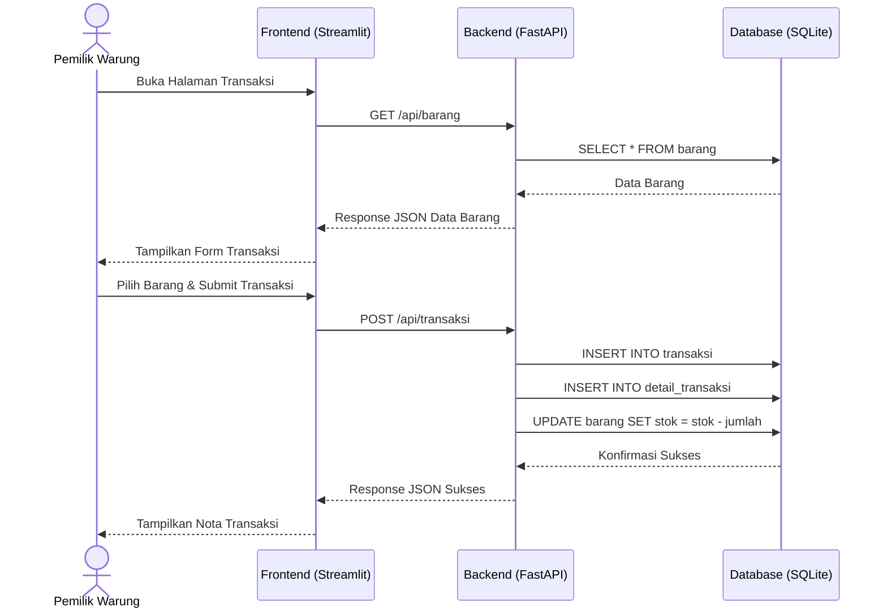

## **4.2.2. Sequence Diagram Prediksi Penjualan** 

Diagram ini menjelaskan alur saat Pemilik Warung mengakses menu prediksi untuk melihat estimasi stok yang harus disediakan pada periode berikutnya. 

**Gambar 8.** Sequence Diagram Prediksi Penjualan 

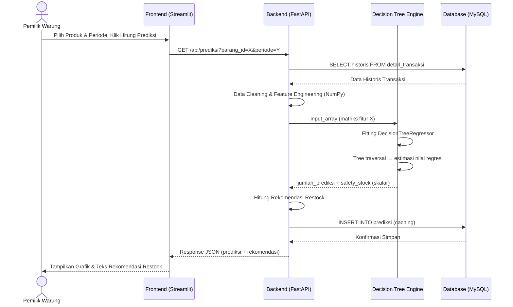

## **4.3. Perancangan Data** 

## **4.3.1. Class Diagram** 

- Menggambarkan struktur kelas objek sistem. Kelas PengantarUser kini langsung merepresentasikan akun Pemilik Warung. 

**Gambar 9.** Class Diagram 

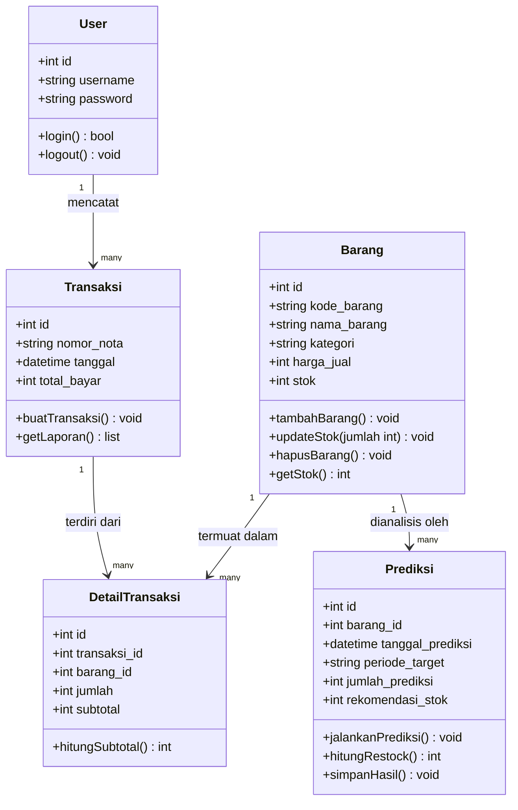

Berdasarkan Gambar 9, perancangan kelas (class diagram) pada sistem ini terdiri dari beberapa komponen objek inti yang saling berinteraksi. Penjelasan dari masing-masing kelas tersebut adalah sebagai berikut: 

1. User: Berfungsi untuk menangani modul autentikasi dan membatasi hak akses masuk ke dalam sistem web pemilik. 

2. Barang: Menyimpan seluruh data master inventaris warung dan memiliki fungsi otomatis untuk memperbarui jumlah stok. 

3. Transaksi: Berfungsi untuk memisahkan data nota global dengan rincian kuantitas barang yang terjual agar pencatatan lebih terstruktur. 

4. Prediksi: Kelas khusus yang menjembatani server dengan algoritma Machine Learning untuk menyimpan dan mengambil data hasil peramalan. 

Alasan Perancangan (Rationale): 

Sistem ini menerapkan Single Responsibility Principle (SRP) dengan memisahkan kelas Prediksi dari kelas Barang. Hal ini dilakukan agar objek barang fokus pada manajemen fisik inventaris, sementara objek prediksi fokus pada analisis statistik masa depan. Pemisahan ini mempermudah perawatan kode (maintainability) dan mencegah terjadinya penumpukan logika fungsi dalam satu kelas. 

## **4.3.2. ERD** 

Struktur relasi database disederhanakan pada tabel users karena tidak memerlukan kolom pengecekan hak akses (role). 

**Gambar 10.** ERD 

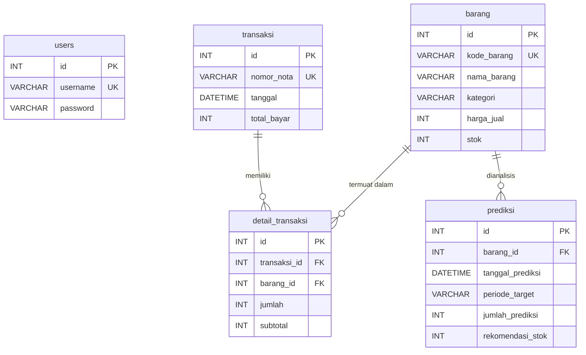

Rancangan basis data pada sistem ini dikembangkan untuk menjamin konsistensi data transaksi dan efisiensi penyimpanan hasil prediksi. Hubungan (kardinalitas) antar tabel dalam ERD dapat dijelaskan sebagai berikut: 

1. transaksi ke detail_transaksi (1 → ⋆): Setiap satu nota transaksi yang diterbitkan dapat memuat satu atau banyak item barang yang berbeda. 

2. barang ke detail_transaksi (1 → ⋆): Setiap satu jenis barang yang terdaftar di warung dapat terjual dalam berbagai transaksi yang berbeda. 

3. barang ke prediksi (1 → ⋆): Setiap satu jenis barang dapat memiliki banyak rekam catatan hasil prediksi dari berbagai periode sebagai bahan evaluasi berkala. 

## Alasan Perancangan (Rationale): 

Keberadaan tabel prediksi yang terpisah merupakan strategi Caching Data. Karena algoritma Decision Tree Regression tetap memerlukan waktu proses untuk melakukan fitting pohon keputusan saat pertama kali dijalankan, menyimpan hasil prediksinya ke dalam database akan mencegah beban kerja server yang berulang (re-computation). Setiap kali pemilik warung membuka dashboard, sistem cukup melakukan kueri SELECT yang cepat tanpa perlu menjalankan proses inferensi ulang model secara terus-menerus. 

## **4.3.3. Struktur Database** 

1. Tabel users 

Digunakan untuk menyimpan data akun Pemilik Warung untuk keperluan autentikasi login. 

|Nama Kolom|Tipe Data|Atribut / Constraint|Keterangan|
|---|---|---|---|
|id|INT|Primary Key, Auto Increment|ID unik pengguna|

|username|VARCHAR (50)|Unique, Not Null|Nama pengguna untuk login|
|---|---|---|---|
|password|VARCHAR (255)|Not Null|Password yang di-hash (keamanan)|

2. Tabel barang 

Digunakan untuk menyimpan data master produk atau barang yang dijual di warung. 

|Nama Kolom|Tipe Data|Atribut / Constraint|Keterangan|
|---|---|---|---|
|id|INT|Primary Key, Auto Increment|ID unik barang|
|kode_barang|VARCHAR (20)|Unique, Not Null|Kode unik produk|
|nama_barang|VARCHAR (100)|Not Null|Nama barang (misal: Indomie Goreng)|
|kategori|VARCHAR (50)|Not Null|Kategori (Mie Instan, Minuman, dll)|
|harga_jual|INT|Not Null|Harga jual per unit barang|
|stok|INT|Not Null|Jumlah persediaan fisik saat ini|

3. Tabel transaksi 

Digunakan untuk mencatat data ringkasan nota transaksi penjualan. 

|Nama Kolom|Tipe Data|Atribut / Constraint|Keterangan|
|---|---|---|---|
|id|INT|Primary Key, Auto Increment|ID unik transaksi|
|nomor_nota|VARCHAR (50)|Unique, Not Null|Nomor bukti transaksi harian|

|tanggal|DATETIM E|Not Null|Waktu dan tanggal transaksi terjadi|
|---|---|---|---|
|total_bayar|INT|Not Null|Total nominal yang harus dibayar|

4. Tabel detail_transaksi Digunakan untuk mencatat rincian barang apa saja yang dibeli dalam satu nomor transaksi (tabel penghubung relasi many-to-many). 

|Nama Kolom|Tipe Data|Atribut / Constraint|Keterangan|
|---|---|---|---|
|id|INT|Primary Key, Auto Increment|ID unik transaksi|
|transaksi_id|INT|Foreign Key (transaksi.id)|Merujuk pada ID di tabel transaksi|
|barang_id|INT|Foreign Key (barang.id)|Merujuk pada ID di tabel barang|
|jumlah|INT|Not Null|Kuantitas barang yang dibeli|
|subtotal|INT|Not Null|Hasil kali dari harga jual dengan jumlah|

5. Tabel prediksi Digunakan untuk menyimpan hasil peramalan kuantitas penjualan dari algoritma Decision Tree Regression sebagai data caching dashboard. 

|Nama Kolom|Tipe Data|Atribut / Constraint|Keterangan|
|---|---|---|---|
|id|INT|Primary Key, Auto Increment|ID unik Prediksi|
|barang_id|INT|Foreign Key (barang.id)|Barang yang diprediksi|

|tanggal_prediksi|DATETIM E|Not Null|Waktu saat proses prediksi dieksekusi|
|---|---|---|---|
|periode_target|VARCHAR (30)|Not Null|Bulan/Minggu target (misal: "Juli 2026")|
|jumlah_prediksi|INT|Not Null|Estimasi jumlah produk yang akan laku|
|rekomendasi_sto k|INT|Not Null|Saran jumlah stok yang harus disediakan|

## **4.4. Perancangan Machine Learning & Analisis Asosiasi (Decision Tree & Apriori)** 

## **4.4.1. Deskripsi Model** 

Sistem menggunakan dua pendekatan analitik/kecerdasan buatan:
1. **Decision Tree Regression**: Diimplementasikan memanfaatkan pustaka Scikit-Learn melalui modul `DecisionTreeRegressor`, didukung oleh NumPy. Model ini bekerja dengan membangun satu struktur pohon keputusan yang membagi ruang data secara rekursif berdasarkan fitur input hingga mencapai node daun yang mengandung nilai estimasi regresi target (kuantitas penjualan mingguan/bulanan).
2. **Algoritma Apriori**: Digunakan untuk Market Basket Analysis (analisis asosiasi produk). Algoritma ini berjalan dengan mengekstrak data histori transaksi dan menghitung nilai *Support*, *Confidence*, dan *Lift* dari kombinasi barang yang dibeli bersamaan. Hasil dari algoritma ini digunakan untuk memunculkan rekomendasi produk pendamping ketika pemilik warung mencatat transaksi penjualan.

## **4.4.2. Struktur Variabel Input (Features) dan Output (Target)** 

Modul Machine Learning tidak dapat membaca data transaksi mentah secara langsung dari database. Oleh karena itu, dilakukan feature engineering untuk mengekstraksi log transaksi menjadi variabel numerik yang siap diproses oleh model. 

- a. Variabel Input / Fitur Elemen (X) 

   - Variabel input adalah kumpulan data historis yang digunakan oleh algoritma Decision Tree untuk mempelajari pola tren penjualan. Variabel yang dirancang meliputi: 

      1. Fitur Waktu (Temporal Features): 

         - Bulan: Representasi angka (1 hingga 12) untuk mendeteksi tren musiman belanja bulanan masyarakat (misal: lonjakan stok menjelang bulan Ramadhan atau Hari Raya). 

         - Minggu ke-X: Indeks minggu dalam satu bulan untuk membaca siklus tanggal muda dan tanggal tua. 

      2. Fitur Produk (Product Features): 

         - barang_id: Identifikasi unik komoditas barang dari database SQLite. 

         - harga_jual: Nominal harga produk untuk mendeteksi apakah perubahan harga memengaruhi minat beli pelanggan. 

      3. Fitur Tren (Lag Features): penjualan_bulan_lalu: Akumulasi kuantitias penjualan produk yang sama pada satu bulan sebelumnya sebagai acuan dasar tren terdekat. 

- b. Variabel Output / Target (Y) 

   - Variabel output merupakan nilai tunggal berjenis data riil skalar yang dihasilkan oleh proses inferensi model. disini outputnya adalah jumlah_prediksi: Estimasi total unit/kuantitas barang tertentu yang diproyeksikan akan terjual pada 1 periode (bulan) ke depan. 

## **4.4.3.** 

## **Aturan Rekomendasi Angka Pembelian Stok (Restock Rule)** 

- Setelah model Decision Tree mengeluarkan angka jumlah_prediksi, sistem backend Flask tidak langsung menampilkan angka tersebut mentah-mentah ke Pemilik Warung. Sistem akan menghitung rekomendasi stok akhir menggunakan rumus Safety Stock (Batas Aman) untuk mengantisipasi keterlambatan pengiriman dari pihak agen grosir: 

## 𝑅𝑒𝑘𝑜𝑚𝑒𝑛𝑑𝑎𝑠𝑖 𝑅𝑒𝑠𝑡𝑜𝑐𝑘 = 𝐻𝑎𝑠𝑖𝑙 𝑃𝑟𝑒𝑑𝑖𝑘𝑠𝑖 + 𝑆𝑎𝑓𝑒𝑡𝑦 𝑆𝑡𝑜𝑐𝑘 − 𝑆𝑖𝑠𝑎 𝑆𝑡𝑜𝑘 

## Contoh Kasus: 

Berdasarkan kalkulasi Scikit-Learn, produk "Indomie Goreng" diprediksi akan laku sebanyak 140 bungkus pada bulan depan. Jika batas aman (safety stock) yang disetel sistem adalah 20 bungkus, dan sisa stok fisik di warung saat ini masih ada 10 bungkus, maka sistem akan menampilkan instruksi teks di halaman ramalan: "BELI LAGI SEBANYAK: 150 BUNGKUS" (140 + 20 - 10). 

## **4.4.4. Alur Proses ML dan Market Basket Analysis (Apriori)** 

Tahapan transformasi data dari database hingga menghasilkan prediksi stok dan rekomendasi asosiasi produk: 

### A. Alur Proses Prediksi Penjualan (Decision Tree)
1. Dataset Penjualan: Penarikan rekaman log data penjualan komoditas dari database SQLite.
2. Cleaning Data: Pembersihan data dari nilai kosong (missing values) atau data duplikat.
3. Feature Selection: Transformasi waktu transaksi menjadi fitur musiman (bulan, minggu ke-X) dan lag fitur (penjualan_bulan_lalu).
4. Training Decision Tree: Melatih model Decision Tree Regressor menggunakan K-Fold Cross Validation.
5. Model Terlatih (Joblib): Model disimpan ke file `.joblib` agar dapat dimuat dengan cepat oleh FastAPI.
6. Prediksi & Restock: Menggunakan model untuk menaksir angka penjualan 5 minggu ke depan dan memberikan rekomendasi restock akhir.

### B. Alur Proses Asosiasi Produk (Apriori)
1. Riwayat Transaksi: Mengambil detail list item barang dari tabel `detail_transaksi` dikelompokkan berdasarkan `transaksi_id`.
2. Generate Frequent Itemsets: Mengidentifikasi barang tunggal dan pasangan barang yang memenuhi kriteria batas minimum dukungan (*min_support*).
3. Aturan Asosiasi: Menghitung nilai keyakinan (*confidence*) dan daya angkat (*lift score*) dari aturan asosiasi (Jika membeli Produk A -> Maka membeli Produk B).
4. Output Rekomendasi: Menyajikan produk rekomendasi B ketika pemilik warung memilih produk A pada halaman kasir/transaksi.

**Gambar 11.** Alur Proses Machine Learning dan Apriori

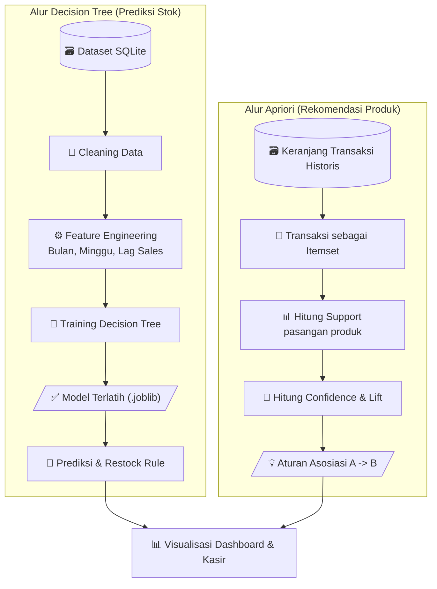

## **4.4.5. Integrasi ML ke Sistem** 

**Gambar 12.** Integrasi Machine Learning ke Sistem 

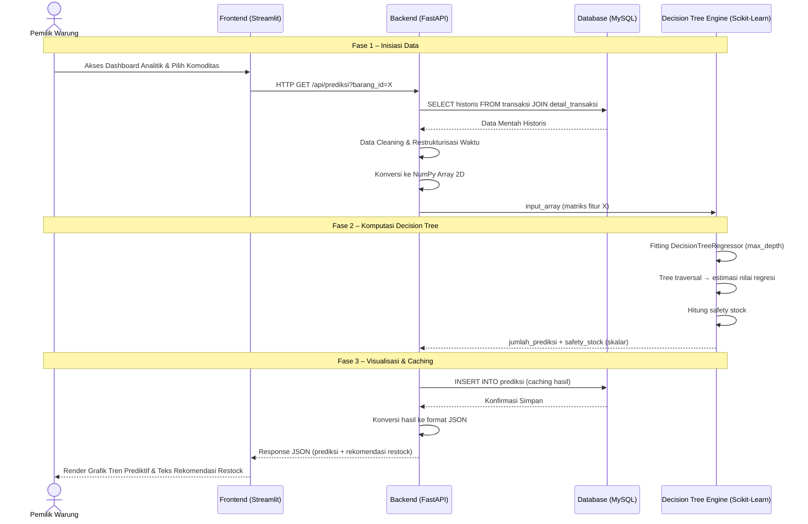

Untuk menjamin kelancaran pertukaran data antara server web (backend) dan modul kecerdasan buatan (Decision Tree Engine), dirancang sebuah mekanisme integrasi yang sinkron. Alur komunikasi dan pembagian tugas antar-komponen dalam memproses fungsi prediksi ini digambarkan secara detail melalui Sequence Diagram pada gambar 12. 

Berdasarkan diagram tersebut, proses integrasi Machine Learning ke dalam sistem web dibagi menjadi tiga tahapan utama sebagai berikut: 

1. Backend Kirim Data ke Model (Fase Inisiasi Data) 

Fase inisiasi data dipicu secara langsung ketika Pemilik Warung mengakses halaman dashboard analitik dan memilih komoditas atau produk spesifik yang akan dianalisis nilai peramalan penjualannya. Secara sistematis, frontend Streamlit akan mengirimkan permintaan data menggunakan protokol HTTP dengan metode GET menuju backend FastAPI. Backend kemudian mengeksekusi kueri (query) ke database MySQL untuk menarik seluruh log historis transaksi penjualan terkait dari tabel transaksi dan detail_transaksi. Data mentah yang berhasil ditarik tersebut tidak langsung dikirim ke model, melainkan melalui tahap pra-pemrosesan oleh backend berupa pembersihan data (data cleaning) dan restrukturisasi format waktu transaksi. Setelah itu, backend melakukan konversi data mentah menjadi bentuk matriks array dua dimensi yang kompatibel dengan komputasi numerik pustaka NumPy, sebelum akhirnya array tersebut dilempar sebagai parameter input ke dalam fungsi Decision Tree Engine. 

2. Model Balikin Hasil (Fase Komputasi Decision Tree) Memasuki fase komputasi Decision Tree, subsistem Machine Learning menerima parameter matriks array dua dimensi tersebut dari backend untuk memulai pemrosesan data historis. Eksekusi dilakukan secara lokal melalui proses fitting `DecisionTreeRegressor` yang membangun pohon keputusan tunggal secara rekursif berdasarkan fitur input, lalu melakukan traversal jalur pohon hingga mencapai node daun yang mengandung nilai estimasi. Proses kalkulasi regresi ini menghasilkan nilai keluaran (output) berupa angka riil skalar yang merepresentasikan estimasi kuantitas penjualan produk pada periode target, sekaligus menghitung nilai batas ambang minimum persediaan barang (safety stock). Seluruh akumulasi nilai hasil perhitungan tersebut kemudian dikembalikan (return value) dari modul Machine Learning ke server backend FastAPI. 

3. Sistem Tampilkan di Dashboard (Fase Visualisasi dan Caching) Fase terakhir adalah visualisasi dan caching, yang diawali dengan penerimaan data hasil prediksi oleh backend FastAPI dari modul Machine Learning. Backend segera mengeksekusi operasi database insert untuk menyimpan rekam prediksi tersebut ke dalam tabel prediksi di database MySQL. Langkah ini berfungsi sebagai mekanisme caching data pada basis data untuk mengoptimalkan performa server dan mencegah terjadinya beban komputasi ulang (re-computation) yang berat saat halaman dashboard disegarkan (refresh) oleh pengguna. Setelah data tersimpan dengan aman, backend FastAPI mengonversi hasil prediksi dari database ke dalam format JSON dan mengirimkannya sebagai respons sukses menuju frontend Streamlit. Pada tahap akhir, frontend Streamlit menangkap respons tersebut dan melakukan proses rendering data menjadi grafik tren prediktif yang interaktif serta menampilkan teks rekomendasi kuantitas penyediaan stok (restock) secara visual pada layar Pemilik Warung. 

## **4.5. Perancangan Antarmuka** 

Perancangan antarmuka (user interface) pada Sistem Prediksi Penjualan Barang ini dibuat menggunakan pendekatan User-Centered Design (UCD) dengan palet warna dominan biru dan putih untuk memberikan kesan bersih, modern, dan profesional. 

Antarmuka sistem web ini dirancang secara responsif agar dapat diakses secara optimal melalui perangkat desktop maupun tablet oleh Pemilik Warung. 

## **4.5.1. Rancangan Antarmuka Halaman Login** 

Halaman login merupakan gerbang utama sistem yang berfungsi untuk memvalidasi hak akses Pemilik Warung sebelum masuk ke dalam sistem. Tata letak halaman ini mengadopsi gaya kartu modern (modern card layout) yang diletakkan tepat di tengah layar untuk menjaga fokus pengguna. 

**Gambar 13.** Rancangan Antarmuka Halaman Login 

Penjelasan mengenai alur elemen pada antarmuka halaman login berpusat pada kesederhanaan proses autentikasi. Halaman ini memuat logo sistem, kolom input username, kolom input password, serta satu tombol aksi utama bertuliskan "Masuk". Ketika Pemilik Warung memasukkan kredensial yang valid dan menekan tombol tersebut, sistem akan memvalidasi data melalui server backend dan mengarahkan pengguna secara otomatis menuju dashboard utama. Sebaliknya, jika data yang dimasukkan tidak sesuai, sistem akan memunculkan notifikasi peringatan di atas kartu login tanpa memindahkan halaman pengguna. 

## **4.5.2. Rancangan Antarmuka Dashboard Utama** 

Dashboard utama dirancang sebagai pusat kendali operasional harian warung. Antarmuka ini menerapkan tata letak tiga bagian utama, yaitu sidebar navigasi di sisi kiri, navbar profil di sisi atas, dan ruang konten utama di bagian tengah. 

**Gambar 14.** Rancangan Antarmuka Dashboard 

Dashboard utama ini menyajikan visualisasi data yang bersifat informatif dan sekilas pandang (at-a-glance analytics). Pada bagian atas ruang konten, terdapat kartu ringkasan akumulasi omzet penjualan harian dan total volume stok barang yang tersisa di gudang. Di bawah kartu informasi tersebut, sistem menyediakan panel khusus bertajuk "Peringatan Stok Menipis" (low stock alerts) yang otomatis mendeteksi komoditas dengan jumlah di bawah ambang batas minimum keamanan stok. Ruang konten bawah diisi oleh tabel inventaris produk terbaru, memudahkan Pemilik Warung dalam memantau pergerakan logistik barang dagangannya tanpa harus membuka menu sekunder. 

## **4.5.3. Rancangan Antarmuka Halaman Analisis Prediksi (Modul ML)** 

Halaman analisis prediksi merupakan fitur unggulan berbasis Machine Learning yang digunakan untuk mendukung keputusan pengadaan barang (restock). Halaman ini mempertahankan struktur sidebar dan navbar yang konsisten, namun memfokuskan ruang konten utama pada grafik peramalan dan rekomendasi kuantitas stok. 

**Gambar 15.** Rancangan Antarmuka Halaman Analisis Prediksi (Modul ML) 

Halaman analitik dan prediksi ini dirancang secara sistematis dengan menyediakan menu tarik-turun (dropdown selection) untuk memilih produk khusus beserta target periode waktu peramalan. Setelah Pemilik Warung menekan tombol "Hitung Prediksi", ruang tengah akan memuat komponen visual berupa grafik garis interaktif yang membandingkan kurva histori penjualan riil masa lalu dengan garis putus-putus sebagai representasi hasil proyeksi algoritma Decision Tree Regression. Pada area terbawah halaman, sistem menampilkan teks kesimpulan berupa estimasi kuantitas produk yang diproyeksikan akan terjual serta rekomendasi angka pasti jumlah unit barang yang harus dibeli kembali ke pihak supplier demi menghindari fenomena penumpukan ataupun kelangkaan barang di warung. 

## **5. Kesimpulan dan Saran** 

## **5.1. Kesimpulan** 

Berdasarkan seluruh tahapan pengembangan yang telah dilaksanakan menggunakan metodologi Agile dengan kerangka kerja Scrum mulai dari penyusunan Product Backlog, eksekusi Sprint berulang, hingga perancangan sistem dan rencana pengujian — Pembangunan Sistem Prediksi Penjualan Barang untuk Mendukung Pengelolaan Stok Warung Menggunakan Algoritma Decision Tree berhasil dirancang sebagai solusi digital terintegrasi untuk mengatasi kelemahan manajemen stok konvensional. Sistem ini mampu mengotomatisasikan pencatatan transaksi penjualan dan sinkronisasi pemotongan persediaan barang secara real-time. Implementasi algoritma Decision Tree Regression menggunakan pustaka Scikit-Learn dengan dukungan NumPy untuk optimalisasi komputasi array pada tahap pra-pemrosesan data memberikan kontribusi krusial dalam menghasilkan angka estimasi penjualan masa depan berbasis data historis riil, sehingga meminimalkan risiko fenomena kehabisan stok (stockout) maupun penumpukan barang (overstock). 

Dari aspek kelayakan finansial dan manajemen proyek, sistem ini terbukti sangat layak untuk diimplementasikan. Dengan estimasi total biaya investasi awal sebesar Rp 4.350.000, analisis keuangan memproyeksikan tingkat pengembalian investasi (ROI) mencapai 88,41% dalam periode tiga tahun, dengan masa balik modal (Payback Period) yang relatif singkat yaitu 1,3 tahun. 

## **5.2. Saran** 

Meskipun sistem telah dirancang dengan matang guna memenuhi kebutuhan operasional saat ini, terdapat beberapa saran yang dapat diajukan untuk pengembangan perangkat lunak ini di masa mendatang: 

1. Integrasi Perangkat Keras Tambahan (Barcode Scanner): Untuk semakin mempermudah Pemilik Warung yang sudah berusia lanjut dalam menginput transaksi penjualan harian, pengembangan selanjutnya disarankan untuk mengintegrasikan sistem web dengan pemindai kode batang (barcode scanner) berbasis USB atau kamera perangkat, sehingga proses pencatatan barang tidak perlu dilakukan secara mengetik manual. 

2. Penerapan Pengingat Otomatis Berbasis Seluler: Sistem dapat dikembangkan lebih lanjut dengan menambahkan fitur gateway pesan pendek (seperti WhatsApp API) untuk mengirimkan notifikasi peringatan stok menipis secara otomatis langsung ke ponsel Pemilik Warung saat mereka sedang berada di luar area warung. 

3. Ekspansi Multi-Aktor dan Fitur Multi-Warung: Jika skala bisnis warung mengalami pertumbuhan di masa depan, arsitektur basis data dan backend FastAPI dapat ditingkatkan dari sistem pengguna tunggal (single actor) menjadi multi-pengguna yang mendukung hak akses karyawan toko serta integrasi sistem pengadaan langsung (supply chain) ke pihak agen grosir resmi. 

4. Peningkatan Model ke Ensemble Learning: Sebagai langkah pengembangan lanjutan, model Decision Tree Regression dapat ditingkatkan menjadi algoritma ensemble seperti Random Forest atau Gradient Boosting untuk meningkatkan akurasi dan ketahanan prediksi terhadap data penjualan yang bersifat fluktuatif. 

## **Daftar Referensi** 

Quinlan, J. R. (1986). Induction of Decision Trees. Machine Learning, 1(1), 81–106. 

Hastie, T., Tibshirani, R., & Friedman, J. (2009). The Elements of Statistical Learning: Data Mining, Inference, and Prediction (2nd ed.). Springer. 

Pedregosa, F., Varoquaux, G., Gramfort, A., Michel, V., Thirion, B., Grisel, O., Blondel, V., Prettenhofer, P., Weiss, R., Dubourg, V., Vanderplas, J., Joly, A., Moreau, T., & Duchesnay, É. (2011). Scikit-learn: Machine Learning in Python. Journal of Machine Learning Research, 12, 2825-2830. 

Pressman, R. S. (2010). Software Engineering: A Practitioner's Approach (7th ed.). McGraw-Hill. 

Sommerville, I. (2011). Software Engineering (9th ed.). Pearson Education.